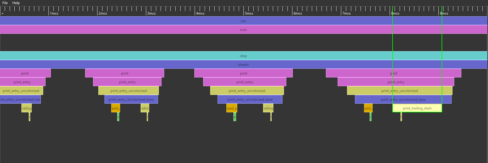
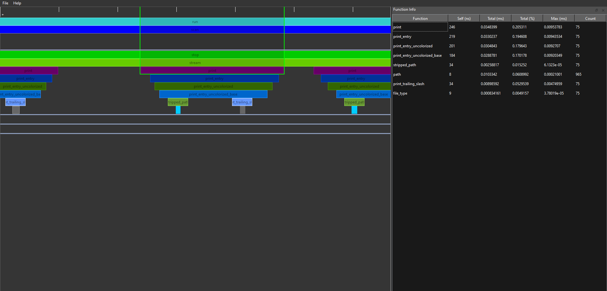
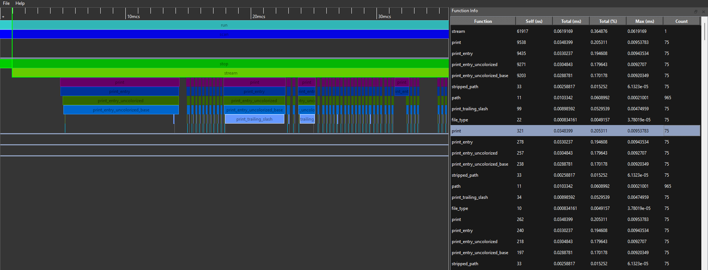

# Uranium Profiler

[\[how to use\]](#usage) [\[how to build\]](#building) [\[screenshots\]](#screenshots)


### Uranium is fast and lightweight instrumentation profiler for Rust written in Rust and C++.

### Main Features:
 - Nanosecond resolution
 - Low overhead per function
 - GUI application to visualize collected data
 - Simple integration with excisting programs

The profiler consists of two main modules: what we call the 'frontend' and the 'backend'. Frontend is the visualizer application, that you see on [screenshots here](#screenshots). Backend is the Rust crate that helps you to collect data from your program.

Currently, Uranium is not production-ready yet. So the only way to use Uranium is to build it from source.

## Building
Supported platforms:<br>
✔ - The module was tested on this platform.
|  Module  | Windows | Linux | MacOS |
| -------- |:-------:|:-----:|:-----:|
| Frontend | ✔       | ✔     |       |
| Backend  | ✔       | ✔     |       |

Please note that currently the backend works only with x86-64 CPUs due to usage of specific instructions (see [tracking issue for this](https://github.com/UraniumTeam/uranium-profiler/issues/11))

### Prerequisites
To build and run *frontend*:
 - **CMake v1.17.0** minimum
 - **Qt v6.0.0** minimum

To build *backend*:
 - **Rust** (Tested with v1.61, may not work with older versions)

### Clone the repository
```shell
git clone https://github.com/UraniumTeam/uranium-profiler
cd uranium-profiler
```
### Build the backend
```shell
cd uranium-backend
cargo build
cd ../uranium-prof-macro
cargo build
```
### Build the frontend
```shell
cd ../uranium-visualizer
cmake -S . -B BuildRelease -DCMAKE_BUILD_TYPE=Release
```
### Run sample program
```shell
cd ../backend-manual-tests
cargo run
```
Now you should see `uranium_session_bin.ups` file and `uranium_session_bin` directory that store data collected by the profier's backend during
the time the sample program was running. You can now open the '.ups' file in profiler frontend.

## Usage
To use Uranium to profile your Rust program you need to add dependencies to your Cargo.toml, place attributes on the functions you want to measure and save the results.
### Cargo Dependencies
Add this to your `Cargo.toml`:
```toml
[dependencies]
uranium_backend = { path = "../uranium-profiler/uranium-backend" }
uranium_prof_macro = { path = "../uranium-profiler/uranium-prof-macro" }
```
Don't forget to change the path to your local clone of the profiler!
### Attributes
Add this uses to the beginning of the files with functions you want to measure:
```rust
use uranium_backend::*;
use uranium_backend::interface::FunctionData;
use uranium_prof_macro::profile_func;
```
Now add this line to every function you want to profile:
```rust
#[profile_func]
fn my_function() -> i32 { /* do stuff */ }
```
### In `main()` Function
And in your `main()` function you need to initialize the profiler and save the session:
```rust
fn main() {
    initialize_uranium();
    /* run the program here... */
    save_session::<BinarySessionWriter>("my_uranium_session");
}
```
### View the Results
When you run the above program, it will measure timings of all your functions and save the collected data to the disk. In this case you will see a directory called 'my_uranium_session' and a file 'my_uranium_session.ups'.
You can now open the '.ups' file in the visualizer (Ctrl+O).

## Screenshots




